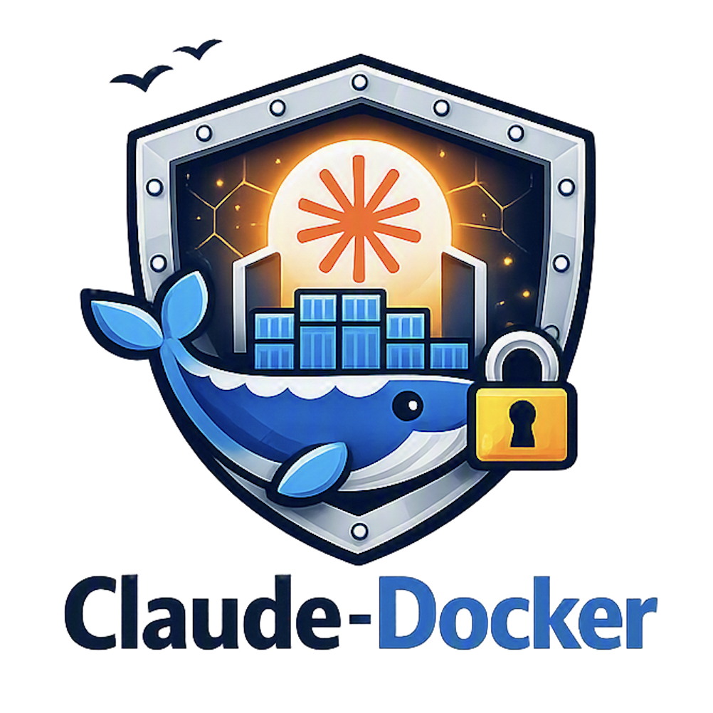

# claude-docker

[](https://github.com/schubergphilis/claude-docker/releases)
[](LICENSE)

</a>

Run Claude Code in a container that inherits your setup but not your filesystem. Workspace access is scoped to the directories you pass in; your statusline, skills, agents, and slash commands ride along as read-only bind-mounts. CLI tools are preinstalled (`gh`, `glab`, `aws`, `openspec`, `uv`, `pnpm`, `tfenv`, `git-lfs`, `task`) plus a version-pinned Go toolchain (`go`) — other language runtimes are not: `tfenv` and `uv` fetch your project-pinned Terraform / Python on demand. Host credentials (`gh`, `glab`, `aws`, `tfe`) are opt-in per flag; nothing leaks in by default.

The VCS and cloud CLIs (`gh`, `glab`, `aws`) need a flag to see host credentials — see [Credential opt-in](#credential-opt-in). The rest work out of the box.

## Install

```bash
# Build the image from your checkout (one-time; rerun after Dockerfile or tool pins change)
docker build -t claude-code:local .

# Put on your PATH (create ~/bin if it doesn't exist)
mkdir -p ~/bin
ln -s "$(pwd)/run.sh" ~/bin/claude-docker
```

The build needs BuildKit (the Dockerfile uses `COPY --chmod`). Docker Desktop ships it by default. A Homebrew `docker` CLI with Colima does **not**: the buildx plugin is a separate formula, and without it `docker build` silently falls back to the legacy builder and dies at the `COPY --chmod` step with `the --chmod option requires BuildKit`. One-time fix:

```bash
brew install docker-buildx
mkdir -p ~/.docker/cli-plugins
ln -sfn "$(brew --prefix)/opt/docker-buildx/bin/docker-buildx" ~/.docker/cli-plugins/docker-buildx
```

Verify with `docker buildx version`, then rerun the same `docker build` — with the plugin present, plain `docker build` uses BuildKit automatically.

## Container runtime

`claude-docker` runs on **docker or podman**. With no configuration it auto-detects the engine, preferring `docker` and falling back to `podman` — so a podman-only host (including Windows via `podman machine` + WSL backend, and podman-as-docker Linux setups) works with zero setup and never hits `docker: command not found`.

To force an engine, set `CLAUDE_DOCKER_RUNTIME`:

```bash
CLAUDE_DOCKER_RUNTIME=podman claude-docker ~/repo
```

The env var is the canonical mechanism: it works everywhere — scripts, CI, editor "run" integrations, and non-interactive shells all inherit it. If you want a shorter interactive spelling, an alias is optional sugar (not a substitute — an alias only resolves at an interactive prompt, so scripts and editors still need the env var):

```bash
alias claude-podman='CLAUDE_DOCKER_RUNTIME=podman claude-docker'
```

Only `docker` and `podman` are accepted; any other value is rejected before anything runs. The image build is the engine's own command — `podman build -t claude-code:local .` on a podman host, mirroring the `docker build` line above.

**Windows / Git Bash:** run `claude-docker` from Git Bash (MSYS/MINGW). The wrapper disables MSYS's automatic POSIX→Windows path rewriting for the engine's argv and translates host mount paths itself, so container-side paths reach `podman.exe`/`docker.exe` intact — no more `invalid option type "\Program Files\Git\workspaces\..."`.

## Usage

```bash
claude-docker                             # current dir as workspace
claude-docker ~/repo-a ~/repo-b           # multi-workspace
claude-docker --yolo ~/repo               # alias for --dangerously-skip-permissions
claude-docker ~/repo -- --resume          # any claude flag after --
```

`claude-docker --help` (or `-h`) prints every wrapper flag with a one-line explanation — the canonical reference.

### Credential opt-in

**Credentials are off by default.** No AWS / GitHub / GitLab / Terraform Cloud / package-registry config, tokens, or env vars reach the container unless you explicitly opt in:

| Flag          | Effect                                                                                                                                                                                                                                                                                                                                                                                                                                                                                                                                                                                |
| ------------- | ------------------------------------------------------------------------------------------------------------------------------------------------------------------------------------------------------------------------------------------------------------------------------------------------------------------------------------------------------------------------------------------------------------------------------------------------------------------------------------------------------------------------------------------------------------------------------------- |
| `--aws`       | Mount `~/.aws/config` and `~/.aws/sso/` read-only and forward `AWS_PROFILE` / `AWS_REGION` / `AWS_ACCESS_KEY_ID` / `AWS_SECRET_ACCESS_KEY` / `AWS_SESSION_TOKEN`. `~/.aws/credentials` (long-lived keys) and `~/.aws/cli/cache/` are **not** mounted.                                                                                                                                                                                                                                                                                                                                 |
| `--gh`        | Starts a per-session **auth proxy sidecar** that holds the GitHub token — the agent container never sees it. Token discovery is unchanged (`GH_TOKEN` / `GITHUB_TOKEN`, else host `gh auth token`, else a silent skip with no sidecar and legacy no-token behavior). When a token is found, the agent container gets a placeholder `GH_TOKEN=claude-docker-proxy`, GitHub traffic is redirected to the sidecar, and the real `Authorization` header is injected in transit. `/root/.config/gh` stays masked while the sidecar is active. See [GitHub auth proxy](#github-auth-proxy). |
| `--gh-direct` | Legacy escape hatch: same token discovery as `--gh`, but forwards the real token straight into the agent container as `GH_TOKEN` — no sidecar. For custom-hostname GitHub (Enterprise **Server**, `*.ghe.com`) and hosts that can't run the sidecar. Mutually exclusive with `--gh` (combining both is a startup error) and shown as its own `gh-direct` statusline tag. Unmasks in-container `gh auth login` state, same as pre-proxy `--gh`.                                                                                                                                        |
| `--glab`      | Mount the platform-appropriate `glab-cli` config dir read-only (macOS: `~/Library/Application Support/glab-cli`, Linux: `~/.config/glab-cli`) and forward `GITLAB_TOKEN`. Unmasks in-container `glab auth login` state — without the flag, `/root/.config/glab-cli/` is hidden by a tmpfs overlay.                                                                                                                                                                                                                                                                                    |
| `--tfe`       | Mount `~/.terraform.d/credentials.tfrc.json` read-only when present and forward `TF_TOKEN_app_terraform_io`. Targets `app.terraform.io` (HCP Terraform) only — self-hosted Terraform Enterprise hostnames and other `TF_TOKEN_<host>` variables are not forwarded. Unmasks in-container `terraform login` state — without the flag, `/root/.terraform.d/` is hidden by a tmpfs overlay. See [Terraform Cloud workflow](#terraform-cloud-workflow).                                                                                                                                    |
| `--registry`  | Surface host-native private package-registry config so in-container `uv` / `pnpm` / pip installs resolve against your private feed (CodeArtifact, Artifactory, Nexus, …) instead of public npm/PyPI. Read-only mounts of `~/.npmrc` / `uv.toml` / `pip.conf` plus `UV_INDEX_*` / `npm_config_registry` / `PIP_*` env when set. `~/.netrc` is intentionally **not** mounted (too broad). Runtime-only; the build is unaffected. **Whole-file mounts** — see [Private package registries](#private-package-registries) for the full channel list and the scoping caution.               |

Combine as needed: `claude-docker --aws --gh ~/repo`. `--gh` and `--gh-direct` cannot be combined with each other.

### Session flags

| Flag          | Effect                                                                                                                      |
| ------------- | --------------------------------------------------------------------------------------------------------------------------- |
| `--ephemeral` | Skip the persistent named volumes. No in-container auth state, shell history, or conversation history persists across runs. |
| `--ro`        | Mount every workspace read-only. Prevents the agent from modifying your code.                                               |

`--ro` does **not** block credential flags or restrict network egress — for an isolated review session, combine `--ephemeral` and `--ro` and pass no credential flags:

```bash
claude-docker --ephemeral --ro ~/untrusted-repo
```

For `--iterm` / `--tmux` (teammate split panes), see [Split-pane agent teams](#split-pane-agent-teams). In-container YOLO narrows the blast radius compared to running on the host, but see [Threat model](#threat-model) for what it does and doesn't protect.

### Resuming sessions across workspaces

Conversation history persists in the shared `claude-code-home` volume (skipped under `--ephemeral`), so `claude --resume` followed by `Ctrl+A` lists sessions from every workspace you've ever used — not just the one you're currently in.

## Host config parity

On every run, these items are dereferenced (symlinks resolved) and bind-mounted read-only into the container at the equivalent `/root/.claude/` path:

| Item                              | Purpose                       |
| --------------------------------- | ----------------------------- |
| `~/.claude/agents/`               | custom agent definitions      |
| `~/.claude/skills/`               | custom skills                 |
| `~/.claude/commands/`             | slash commands                |
| `~/.claude/CLAUDE.md`             | global preferences (`gprefs`) |
| `~/.claude/statusline-command.sh` | statusline renderer           |

For `settings.json`, maintain a dedicated `~/.claude/settings.docker.json` (any valid Claude `settings.json` schema) — when present it's copied to `/root/.claude/settings.json` at container start. A copy rather than a bind mount, because Claude Code saves settings by renaming a tmp file over `settings.json` and `rename()` over a mountpoint fails with `EBUSY` — so in-session settings changes (effort, model, theme) actually save; they last for that container run, are re-seeded from the host file on the next start, and are never written back to the host. Keeping it separate from your host `settings.json` avoids dragging macOS-only keys (`sandbox`, `env.SSL_CERT_FILE`, `enabledPlugins`) or host-filesystem `hooks` into the container. See [`examples/settings.docker.json`](examples/settings.docker.json) for a starting point.

### Alternate Claude config dirs (`--claude-dir`)

If you keep more than one host Claude config (e.g. a personal `~/.claude/` and a work-only `~/.claude-work/`), point the wrapper at the one you want with `--claude-dir=PATH` or the `CLAUDE_DOCKER_CONFIG_DIR` env var:

```bash
claude-docker --claude-dir=~/.claude-work ~/repo
CLAUDE_DOCKER_CONFIG_DIR=~/.claude-work claude-docker ~/repo
```

The chosen dir takes the place of `~/.claude` for every item in the parity table above (agents, skills, commands, `CLAUDE.md`, statusline, `settings.docker.json`).

### Git identity

`user.name` and `user.email` from your global git config (`~/.gitconfig`) are forwarded automatically as `GIT_AUTHOR_NAME`/`GIT_AUTHOR_EMAIL`/`GIT_COMMITTER_NAME`/`GIT_COMMITTER_EMAIL` so in-container `git commit` works out of the box with your real identity — no `git -c user.email=...` dance, no wrong-author commits. Not gated by a flag: identity is already public on every commit you've made. Signing keys, credential helpers, aliases, and hooks are NOT forwarded — those are host-specific (keychains, absolute paths) and would misfire inside the container.

### Statusline tag for active opt-ins

`run.sh` exports `CLAUDE_DOCKER_FLAGS` into the container with the comma-separated list of active opt-ins (`gh`, `gh-direct`, `aws`, `glab`, `tfe`, `ephemeral`, `ro`) and wraps the host statusline script so a yellow `docker:<flags>` tag is prepended to whatever your personal statusline renders. The variable is set by the wrapper for the statusline to read — not a user-tunable knob. `--yolo` / `--dangerously-skip-permissions` is not surfaced here — Claude Code's own mode indicator already makes it obvious. The wrapper is a no-op passthrough when no opt-ins are active, so your statusline looks unchanged on a plain `claude-docker ~/repo`.

The image sets `IS_SANDBOX=1` — historically required to let `--yolo` / `--dangerously-skip-permissions` work when claude ran as root. The entrypoint now drops to the host UID before exec'ing claude, so the root-user check no longer triggers in steady state; `IS_SANDBOX=1` remains as a safety net for the legacy `HOST_UID=0` fall-through path. OS-level hardening comes from `--cap-drop ALL` (with `CHOWN`, `SETUID`, `SETGID`, `DAC_READ_SEARCH` re-added for transient entrypoint use only), `--security-opt no-new-privileges`, the Docker default seccomp profile, `--init` (tini reaps subprocess zombies), and the bind-mount layout. See [File ownership](#file-ownership) and [Threat model](#threat-model) below.

## Auth model

Credentials are opt-in per run — see [Credential opt-in](#credential-opt-in) above for the per-flag effect, mounts, and env-var forwarding. The subsections below cover the two workflows that need more than a one-line table cell.

### AWS SSO flow (`--aws`)

Standard SSO usage works unchanged: `aws sso login --profile X && export AWS_PROFILE=X` on the host, then `claude-docker --aws`. The container reads the short-lived SSO bearer token from `~/.aws/sso/cache` via the read-only mount.

If you'd rather not mount `sso/cache` either, flatten to env vars after login:

```bash
aws sso login --profile X
eval "$(aws configure export-credentials --profile X --format env)"
claude-docker --aws ...
```

Container then uses `AWS_ACCESS_KEY_ID`/`SECRET`/`SESSION_TOKEN` and the SSO cache is not needed inside. Temp creds freeze at container start (~1h TTL).

### GitHub auth proxy

`--gh` starts a per-session **auth proxy sidecar** (pinned Caddy image `caddy:2.11.4@sha256:844f60b64e4724a5aa8245e019dace0d3f199f7433ce6c57676cb30a920dbad9`, override via `CLAUDE_DOCKER_PROXY_IMAGE`) that holds the real GitHub token so the agent container never sees it. Token discovery is unchanged: `GH_TOKEN` / `GITHUB_TOKEN`, else host `gh auth token`, else a silent skip — no token found means no sidecar, and the session behaves like the legacy no-token fallback (empty `GH_TOKEN`, in-container `gh auth login` still works and persists as before).

When a token is found:

- The agent container gets a placeholder `GH_TOKEN=claude-docker-proxy` — enough for `gh` to consider itself authenticated. `gh auth token` inside the container returns this placeholder, not your real token, and it doesn't appear anywhere in the container's environment or filesystem.
- `github.com`, `api.github.com`, and `uploads.github.com` resolve to the sidecar via `--add-host`. `objects.githubusercontent.com` and `codeload.github.com` (pre-signed release/archive URLs) are **not** intercepted — they resolve normally and never see the token.
- The sidecar terminates TLS for those three hostnames with a CA generated fresh for the session; the private key never leaves the sidecar and is destroyed with it at teardown. The public root is installed into the agent container's trust store by the entrypoint (`update-ca-certificates`, before privilege drop), and `NODE_EXTRA_CA_CERTS` points at it, so `git`, `gh`, and node-based tooling all trust it natively. `UV_SYSTEM_CERTS=1` is set for the same reason: `uv`'s rustls client reads neither the OS bundle nor `NODE_EXTRA_CA_CERTS` by default, so without it every `uv` fetch from `github.com` fails `invalid peer certificate: UnknownIssuer` while `git`/`gh`/`curl` work. Verification stays on — `uv` just checks against the same session root.
- The sidecar injects the real `Authorization` header in transit — `Basic base64(x-access-token:<token>)` for `github.com` (git smart-HTTP), `Bearer <token>` for `api.github.com` / `uploads.github.com` — replacing anything the client sent. One deliberate exception: a **`HEAD` on `github.com/<owner>/<repo>/releases/download/…`** is forwarded with the header _removed_. GitHub routes a release-asset `HEAD` carrying any `Authorization` to a legacy `objects.githubusercontent.com` pre-signed URL that answers `401` to every method, while an anonymous `HEAD` gets the working `release-assets.githubusercontent.com` CDN — so tools that probe with `HEAD` before `GET` (`uv`, `pip`) could not install from a release-asset URL at all. The credential buys nothing there: that endpoint doesn't accept token auth in the first place (see the limitation on private release assets below). `GET` on the same path keeps its credential, as does everything else. `/root/.config/gh` stays tmpfs-masked while the sidecar is active: the placeholder token already satisfies `gh`, so persisted in-container login state would just be a second, unneeded secret.

**Isolation and lifecycle.** Each invocation gets its own network (`claude-gh-<id>`) and sidecar (`claude-gh-proxy-<id>`), so concurrent sessions never share a token copy, a CA, or traffic. Teardown happens in `run.sh`'s existing `EXIT` trap, extended and installed _before_ any sidecar or network is created, so a failure mid-startup can't leak either resource. Startup is **fail-closed**: if the sidecar won't start or its CA can't be retrieved in time, `run.sh` tears everything down and exits with an error — it never falls back to forwarding the real token. `run.sh` prints the sidecar's container name at startup.

**Re-login and rotation are host-managed.** Under the proxy, GitHub auth is not something you manage from inside the container. `gh auth status` reports authentication via the `GH_TOKEN` env var (the placeholder), so `gh auth login` inside the container is a no-op: `gh` won't override an env-var token, `/root/.config/gh` is masked and ephemeral, and the sidecar rewrites the `Authorization` header on every request regardless of what's stored inside. To switch account or change scopes, do it **on the host** (`gh auth login` / `gh auth refresh`, or export a different `GH_TOKEN`) and relaunch — the sidecar reads the host token fresh at each container start, so a new session is how a changed credential flows in. A running container keeps working on the token it captured at launch until _that container_ exits; host-side changes never propagate into it live. (In-container `gh auth login` only works in the two no-sidecar modes: `--gh-direct`, and `--gh` when no host token was found.)

> **Revoking vs. re-login — they are not the same.** `gh auth logout` / `login` / `refresh` only change your host's _local_ credential store; none of them revokes a previously-issued token at GitHub. GitHub CLI's OAuth token is long-lived, so a token captured earlier (by a running sidecar, or exfiltrated) stays valid until you **explicitly revoke** it: for OAuth login, _GitHub → Settings → Applications → Authorized OAuth Apps → GitHub CLI → Revoke_; for a PAT, delete it under _Settings → Developer settings_. Relaunching only stops a _new_ container from using the old token — it does not invalidate the old one.

**Filtering and policy.** The generated Caddyfile blocks the one broadly destructive call by default: `DELETE` on `/repos/{owner}/{repo}` gets a `403` naming the claude-docker gh-proxy policy and never reaches GitHub. Extend it with `CLAUDE_DOCKER_GH_POLICY=<path>` pointing at a Caddyfile snippet — `run.sh` stages it and `import`s it into the **`api.github.com` site block only** (a snippet written for `github.com` or `uploads.github.com` traffic has no effect). Policy config lives solely in the sidecar; the agent container can neither read nor write it.

**Audit log.** Every proxied request (method, path, status — no headers, no token) is written as structured JSON to the sidecar's stdout. View it live with `docker logs <sidecar-name>` (the name `run.sh` prints at startup). The log is deliberately not persisted past the session — it's meant for live debugging, not a compliance trail. It's still a net improvement: host-side `gh` usage has no audit log at all today.

**`--gh-direct`** restores the pre-proxy behavior: the real token is forwarded straight into the agent container as `GH_TOKEN`, no sidecar involved. Use it for custom-hostname GitHub — Enterprise **Server** (`github.mycompany.com`) or GHEC data residency (`*.ghe.com`) — where the sidecar can't intercept the right hostnames, or on hosts that can't pull the Caddy image. github.com organizations under a GitHub Enterprise **Cloud** account use the standard `github.com` / `api.github.com` hostnames and _are_ fully covered by the proxy — `--gh-direct` is only needed for organizations on a genuinely custom hostname. Passing `--gh` and `--gh-direct` together is a startup error, and the statusline tags them distinctly (`gh` vs `gh-direct`) so a riskier direct-forwarding session is visible at a glance.

**Limitations:**

- TLS clients that don't read the OS trust store — notably Python's `certifi`-bundled CA set — get certificate errors against the three intercepted hostnames, since they never see the entrypoint-installed session CA. `uv` is handled for you (`UV_SYSTEM_CERTS=1`, above); for others, point the tool at the system store explicitly (`SSL_CERT_FILE=/etc/ssl/certs/ca-certificates.crt`, or `REQUESTS_CA_BUNDLE` for `requests`/`certifi` consumers) or use `--gh-direct`.
- Release assets in **private** repos aren't reachable via their `https://github.com/<owner>/<repo>/releases/download/…` URL. That's GitHub's behavior, not the proxy's: the web download path accepts only browser-session auth, so a token-authenticated request 404s with or without the proxy. Use the API asset endpoint instead — `gh release download`, or `GET /repos/{owner}/{repo}/releases/assets/{id}` with `Accept: application/octet-stream` — both of which go through `api.github.com` and work normally. Public release assets work directly.
- SSH remotes (`git@github.com`) remain unsupported, as before — `--gh` never mounted a key or agent. The failure mode changes from an auth prompt to connection-refused, since `git@github.com` now resolves to the sidecar on a port it doesn't serve.
- git-LFS is expected to work unchanged: the batch endpoint on `github.com` gets the same `Authorization` injection as any other git smart-HTTP request, and the actual object transfer happens against pre-signed, non-intercepted hosts. It's covered by the [manual checklist](#manual-fallback-checklist-macos) rather than called out as a limitation.

### Terraform Cloud workflow

Standard usage targets `app.terraform.io` (HCP Terraform):

```bash
# One-time on the host: writes ~/.terraform.d/credentials.tfrc.json
terraform login app.terraform.io

# Per session
claude-docker --tfe ~/repo

# Inside the container, fetch the project-pinned terraform version
tfenv install            # reads .terraform-version, downloads from releases.hashicorp.com
terraform plan
```

The image ships `tfenv` (a pure-bash terraform version manager) and **does not** ship a pre-installed `terraform` binary version — versions are project-pinned (`required_version` / `.terraform-version`) and a single bundled version would drift against real workspaces. `tfenv install` writes terraform binaries under `/opt/tfenv/versions/`, which is **not** in the `claude-code-root` named volume; downloads do not persist across `docker run --rm` exits. Power users can build a child image (`FROM claude-code:local`) that runs `tfenv install <version>` at build time to bake a specific version into a derived image.

Token alternative: instead of (or in addition to) the credentials file, export `TF_TOKEN_app_terraform_io=<token>` on the host and `--tfe` will forward it. The terraform CLI honours both.

### Private package registries

> **⚠️ Use with care — the npmrc/pip.conf mounts are whole-file, not just the registry line.** Everything in a mounted file becomes readable inside the container, including credentials and settings unrelated to your package feed. Inspect these files before using:
>
> - **`~/.npmrc`** often carries tokens for _several_ registries (npmjs.org, GitHub Packages, other scoped feeds) plus unrelated npm settings — all of it spills over, not just your private feed's entry.
> - **`pip.conf`** likewise carries any global pip settings you've set, not only `index-url`.
> - **`~/.netrc` is deliberately NOT mounted** — as a machine-keyed store of logins for arbitrary unrelated hosts it's the broadest offender, so `--registry` never forwards it. Put registry auth in `~/.npmrc` / `pip.conf` / the index URL / `UV_INDEX_*_PASSWORD` instead.
>
> The forwarded _env vars_ are tightly scoped (named individually), so the over-share is specific to the npmrc/pip.conf file mounts. To minimise exposure, prefer the env-var channel or keep registry-only config files, and remember the container has full network egress (see [Threat model](#threat-model)).

`--registry` makes the in-container package managers resolve against a private feed (AWS CodeArtifact, Artifactory, Nexus, GitLab/Azure, …) the same way your pipelines do — without inventing any claude-docker-specific config. It surfaces the package managers' **own native config** from the host, read-only:

| Channel                       | npm / pnpm                                                                   | uv                                                                                                                                            | pip / pipenv                                                                                               |
| ----------------------------- | ---------------------------------------------------------------------------- | --------------------------------------------------------------------------------------------------------------------------------------------- | ---------------------------------------------------------------------------------------------------------- |
| Config file (`:ro` mount)     | `~/.npmrc` (or `npm_config_userconfig`)                                      | `~/.config/uv/uv.toml`                                                                                                                        | platform `pip.conf` (macOS: `~/Library/Application Support/pip/pip.conf`, Linux: `~/.config/pip/pip.conf`) |
| Env vars (forwarded when set) | `npm_config_registry`, `NPM_CONFIG_REGISTRY`, `NODE_AUTH_TOKEN`, `NPM_TOKEN` | `UV_INDEX_URL`, `UV_DEFAULT_INDEX`, `UV_EXTRA_INDEX_URL`, `UV_INDEX`, `UV_KEYRING_PROVIDER`, and any `UV_INDEX_<NAME>_USERNAME` / `_PASSWORD` | `PIP_INDEX_URL`, `PIP_EXTRA_INDEX_URL`, `PIP_TRUSTED_HOST`, `PIPENV_PYPI_MIRROR`                           |

(`~/.netrc` is intentionally absent from this table — see the caution above.)

Mounts are read-only and composable with other flags; `--registry` does **not** require `--aws`. Resolution policy is whatever your host config already expresses: setting a default registry/index natively _replaces_ the public default (confining resolution to your feed), and re-adding public registries is done in your own native config — the wrapper imposes no policy of its own.

If you've relocated your npm config via `npm_config_userconfig` / `NPM_CONFIG_USERCONFIG`, that path is sourced instead of `~/.npmrc` (and still mounted at the container's default `/root/.npmrc`), so a relocated config doesn't silently fall through to public npm.

Standard AWS CodeArtifact flow (the per-tool `login` commands write the token into the native config files the flag then mounts):

```bash
# One-time on the host, per ecosystem you use:
aws codeartifact login --tool npm --domain D --domain-owner ACCT --repository R   # → ~/.npmrc
aws codeartifact login --tool pip --domain D --domain-owner ACCT --repository R   # → pip.conf
# uv: export the index + token (uv has no `codeartifact login`):
export UV_INDEX_URL="https://aws:$(aws codeartifact get-authorization-token --domain D --domain-owner ACCT --query authorizationToken --output text)@D-ACCT.d.codeartifact.REGION.amazonaws.com/pypi/R/simple/"

# Per session
claude-docker --registry ~/repo
```

The captured token freezes for the life of the container (a CodeArtifact token is ≤12h) — when it expires, re-run the host `login`/`export` and relaunch. Same posture as the `--aws` SSO credentials.

**No Python is bundled.** `pip`/`pipenv` themselves are not in the image (uv fetches its own Python; project runtimes live in child images). Run a pip-based tool via `uvx pipenv …` — pipenv shells out to pip, which reads the forwarded `pip.conf` / `PIP_*`. Caveat: if your feed is fully locked down with no public upstream, `pipenv` itself must be mirrored there for `uvx` to fetch it.

**Build vs. runtime.** `--registry` is **runtime-only**. The image _build_ always resolves its own tooling (claude-code, openspec, pnpm) against the public npm registry / PyPI regardless of any private registry configured on your host — your `~/.npmrc` and `npm_config_*` env are neither in the build context nor inherited by Dockerfile `RUN` steps. That isolation is what keeps the build reproducible from the committed pins. Routing the build itself through a private registry is intentionally out of scope.

## File ownership

Files created inside the container appear on the host owned by the user who launched `claude-docker`, not by `root`. The wrapper forwards `HOST_UID` / `HOST_GID` and the in-container entrypoint creates a matching passwd entry and drops to it via `runuser` before exec'ing claude. Persistent state in the `claude-code-root` and `claude-code-home` named volumes is chowned on first start, so an existing volume from before this change is fixed up the next time you run `claude-docker`.

## Threat model

The container narrows blast radius vs. running `claude --yolo` on the host, but it is **not** a full sandbox:

- **Protected:** host filesystem outside your passed workspaces, host `~/.aws/credentials` (long-lived keys), host AWS/glab config dirs are read-only from inside (container can't persist changes back).
- **Exposed (per session):** your passed workspaces are read-write (unless `--ro`); host credentials when opted in — short-lived AWS SSO bearer tokens (`~/.aws/sso/cache`), the glab config token, `~/.terraform.d/credentials.tfrc.json`, and `GITLAB_TOKEN` / `TF_TOKEN_app_terraform_io` / `AWS_*` env vars are all readable inside the container; under `--gh-direct` (but **not** plain `--gh`, see [GitHub auth proxy](#github-auth-proxy)), the real `GH_TOKEN` is readable inside the container too; under `--registry`, the **full contents** of mounted `~/.npmrc` / `pip.conf` (and forwarded `*_TOKEN` / `UV_INDEX_*_PASSWORD` env) are readable — and those files can hold tokens for registries beyond the one you intended (`~/.netrc` is deliberately not mounted, see [Private package registries](#private-package-registries)); full outbound network with no egress filtering.
- **GitHub via the proxy (`--gh`):** the real token itself no longer reaches the agent container — the biggest prior exposure for this flag is gone. What remains is _live capability_: a compromised session can still act on GitHub through the sidecar for the life of the session, bounded by its policy (default: no repo deletion, extensible via `CLAUDE_DOCKER_GH_POLICY`) and recorded in its audit log if you capture it (`docker logs <sidecar-name>`) before teardown. The sidecar is a policy point and a record, not a guarantee that a compromised session can't act on GitHub at all.
- **Exposed (cross-session):** the persistent `claude-code-root` and `claude-code-home` named volumes hold the Claude OAuth token, in-container `gh` / `glab` / `terraform login` state, shell history, and conversation history. `claude --resume` can replay sessions from **any** past workspace — see [Resuming sessions across workspaces](#resuming-sessions-across-workspaces). Skipped under `--ephemeral`.
- **Runtime code-fetch:** `npx`, `pnpm dlx`, `uvx`, `tfenv install`, and the Go toolchain fetch and execute arbitrary code from public sources on first use — npm and PyPI for the package managers, `releases.hashicorp.com` for `tfenv install`, `proxy.golang.org` for `go build` / `go install` / `go run`. Under `--yolo`, a prompt-injected workspace can trigger these. `pnpm dlx` adds zero marginal blast radius vs the already-reachable `npx`; `uvx` is a _new_ PyPI execution primitive (no Python runtime existed in the image before); `tfenv install` is a _new_ HashiCorp release-channel execution primitive whose downloaded `terraform` binary is intentionally **not** sha256-pinned in the image (versions are project-pinned via `.terraform-version`, so the image stays neutral on version policy). Go adds two such primitives: module downloads (checksum-verified against the pinned `go.sum` and, for new modules, the public `sum.golang.org` transparency log) and — because `GOTOOLCHAIN` is left at its default `auto` — the on-demand download of a _different_ Go toolchain when a project's `go.mod` requires one newer than the pinned `GO_VERSION`. That download is signed-and-checksummed by the same module machinery, but it does mean the image's Go pin is a floor, not a ceiling; set `GOTOOLCHAIN=local` in the container to refuse it and fail loudly instead. Build-time installs of the CLIs themselves are pinned by version + sha256 where the ecosystem supports it (uv binary, glab .deb, AWS CLI, tfenv source archive, Go tarball), by version alone from a signature-verified apt repo for `nodejs` and `task` (no committed hash, but apt checks the repo's signed index and the package digests it carries), and by version only for npm-backed packages (claude-code, openspec, pnpm) — `--ignore-scripts` blocks lifecycle scripts at install time but does not protect against a compromised registry serving a malicious tarball at the pinned version.
- **Private registries (`--registry`):** this _narrows_ where the package managers resolve packages — pointing `uv` / `pnpm` / pip at a curated private feed instead of public npm/PyPI — which can reduce dependency-confusion exposure, but only as much as your host config and the feed's upstream setup dictate. It is registry-resolution config, **not** network egress filtering: `npx`, `git+https` installs, `curl`, and every other egress path are unaffected, and `--yolo` runtime code-fetch (above) still reaches whatever the resolved feed serves. Treat it as supply-chain hygiene, not a network boundary.
- **If a session is compromised:** assume exfiltration already happened (full network egress). Then: rotate the host sessions for every flag that was passed — `glab auth login`, `aws sso login`, `terraform login`; under `--registry`, re-run `aws codeartifact login` / rotate the npm·PyPI registry tokens exposed via the mounted `~/.npmrc` / `pip.conf`. **GitHub is different under `--gh`:** the real token never entered the container, so there's no token to rotate on that basis alone — but review what the session _did_ through the proxy during its lifetime (the sidecar's audit log helps, if you captured it via `docker logs` before teardown), and revert any resulting GitHub-side actions. If the token itself may be exposed (a `--gh-direct` session, a version predating this proxy, or any doubt), **revoke** it — not merely `gh auth logout`/`login`, which only clear local state and leave the issued token valid at GitHub: revoke the _GitHub CLI_ authorization under _Settings → Applications → Authorized OAuth Apps_, or delete the PAT under _Settings → Developer settings_ if you used one. In all cases: revoke the Claude OAuth credential, and clear the named volumes (`docker volume rm claude-code-root claude-code-home`) to flush in-container auth state and cross-workspace conversation history that `claude --resume` could otherwise replay.

Hardening applied at runtime: `--cap-drop ALL --cap-add CHOWN --cap-add SETUID --cap-add SETGID --cap-add DAC_READ_SEARCH` — the four added caps are held only during entrypoint setup and cleared from the effective / permitted / ambient sets by the kernel when the entrypoint drops UID 0 → host UID (the bounding set retains them but is inert under `no-new-privileges`), so claude itself runs with no usable capabilities; `--security-opt no-new-privileges`; `--init` (tini reaps subprocess zombies — `runuser` would otherwise be PID 1); container starts as root and drops to the host user before exec'ing claude (see [File ownership](#file-ownership)); the Docker default seccomp profile; scoped workspace bind-mounts; tmpfs masks over non-opted-in credential paths. Build-time: pinned base image digest, sha256-verified downloads where the ecosystem supports it (uv, glab, AWS CLI, tfenv source, Go tarball); npm packages (claude-code, openspec, pnpm) are version-pinned with `--ignore-scripts` but not sha256-verified — a compromised npm registry serving a malicious tarball at the pinned version would not be caught at build time. **Not** applied: read-only root filesystem, user-namespace remapping, custom seccomp profile (Docker's default is in use), network egress filtering, resource limits.

## Updating pinned tool versions

`uv`, `glab`, `aws-cli`, and `tfenv` are downloaded directly from GitHub/GitLab/vendor sites rather than from a language package registry, so nothing else verifies the bytes. Each is pinned to a version **and** a per-architecture sha256 that the Dockerfile checks (`sha256sum -c`) before installing. The npm-installed tools (`claude-code`, `openspec`, `pnpm`) are pinned by version only — `npm install` already verifies the tarball against the registry's `dist.integrity`, and CI additionally runs `npm audit signatures`.

The pins live in version-controlled fragments under [`pins/`](pins/), one `pins/<tool>.env` per tool, which the Dockerfile `COPY`s and sources at build time — so `docker build` is reproducible from the committed files.

Refresh them with [`update_pins.py`](update_pins.py) (a single stdlib-only Python file, run via `uv`):

```bash
uv run update_pins.py                      # refresh all tools (7-day soak)
uv run update_pins.py --soak 14            # wider soak window
uv run update_pins.py --block-major-bumps  # stay within each tool's current major
uv run update_pins.py --pin uv=0.12.3      # pin one tool to a specific version
```

For each tool it selects the newest stable version at least 7 days old, downloads the `amd64` and `arm64` artifacts, computes their sha256s, and rewrites `pins/<tool>.env` — the soak window gives a release time to be vetted (and a bad one pulled) before it enters the image. The script prints a report — each `old → new` bump with its age, a `⬆ MAJOR` marker on major-version jumps, `held` lines for versions still inside the soak window, and `⚠` reminders for the manual pins — then review the diff, build to test, and commit. By default a major-version bump is taken once it has soaked; `--block-major-bumps` keeps a run within each tool's current major. Set `GITHUB_TOKEN` (or `GH_TOKEN`) to avoid GitHub's unauthenticated rate limit.

A weekly GitHub Actions run does the same thing unattended: [`pins-updater.yml`](.github/workflows/pins-updater.yml) fires every Monday (and on demand via _Run workflow_, where you can override the soak window or ask for `--block-major-bumps`), runs the same script, and — if any pin moved — force-pushes the `bump/pins` branch and opens (or refreshes) a single PR carrying the script's full report. One long-lived branch on purpose: a stale pins PR proposes versions that the next refresh has already superseded, so the newest run replaces the open PR rather than stacking another one beside it. The workflow invokes the script as `python3 update_pins.py` on the runner's preinstalled interpreter — it is stdlib-only, so there is nothing for `uv` to resolve and no toolchain to install first. Review the diff and let CI build the image before merging; the manual pins the report flags under `⚠ needs your eyes` still need a separate, hand-written commit.

> **CI on the automated PR — set `PINS_UPDATER_TOKEN` before enabling this.** Without that secret the PR is opened with the job's `GITHUB_TOKEN`, and GitHub deliberately does **not** trigger `pull_request` workflows for those. Since `main`'s ruleset requires the `Validate` and `Docker build (validate, no push)` checks, they never report and the PR **can't be merged** — not merely "unverified" — until a human pushes an empty commit or closes and reopens it. Add a fine-grained PAT scoped to this repo with `contents: write` + `pull requests: write` (or a GitHub App token) as the `PINS_UPDATER_TOKEN` repo secret and the workflow uses it instead, so CI runs on the PR as it would for a human.

`nodejs` (from NodeSource's signed apt repo), the Go toolchain, and the `ubuntu` base-image digest are pinned manually: the script reports base-digest drift and how the Go pin compares to the latest stable release, but does not rewrite either, since moving the base OS is a deliberate, separately-reviewed change. Go stays manual for a different reason — go.dev's release feed carries no publish dates, so the soak window can't be evaluated from it; the pin lives in the Dockerfile as `ARG GO_VERSION` plus a per-arch sha256, and the comment above it carries the exact `curl | jq` to read the new version and both hashes when bumping.

The [GitHub auth proxy](#github-auth-proxy) sidecar's Caddy image is pinned manually too, but lives outside this whole mechanism: the digest is a default in `run.sh` (`CLAUDE_DOCKER_PROXY_IMAGE`), not a file under `pins/`, and `update_pins.py` never touches it. That's deliberate — a Caddy upgrade can change Caddyfile directive semantics, i.e. the security-critical config this feature generates, so bumping it means reading the changelog and validating the generated Caddyfile against the new version by hand, not taking an automated version bump on faith.

## Git worktrees

Git worktrees embed the path between the worktree and its repo's `.git/` in two link files. By default those paths are absolute, so a worktree created on the host breaks inside the container (and vice versa) because the same files sit at different absolute paths in each environment.

**No host config change needed.** For every workspace whose `.git/config` is a regular file (i.e. the main repo, not a worktree pointer), `claude-docker` overlays a container-only copy of `.git/config` that declares `extensions.relativeWorktrees = true` and `worktree.useRelativePaths = true`. The host's on-disk `.git/config` is never touched. Worktrees created inside the container therefore get relative paths, and those link files are then portable to the host without any opt-in.

This asymmetry is deliberate: the extension flag — when written into the host's `.git/config` — blinds tools that bundle an older libgit2 (notably `gitstatusd`, which powers the Powerlevel10k git prompt), because they refuse to open a v1 repo declaring an extension they don't know. Keeping the flag container-only sidesteps that.

To convert pre-existing absolute-path worktrees: from inside the container, run `git worktree repair --relative-paths <worktree-path>`. New worktrees added in the container get relative paths automatically.

**Trade-off:** container-side `git config` writes (e.g. `git remote add ...` writing to local config) land in the ephemeral overlay and are discarded when the container exits. Persistent `git config` edits should happen on the host.

**Fallback — `git worktree repair` (no flag), inside the container:**

```bash
git worktree repair
```

Use this when you passed a repo and a _sibling_ worktree as separate workspace args (`claude-docker ~/repo ~/repo-feature`). Sibling-flattened mounts collapse the parent directory, so the relative offset between worktree and repo is not preserved by the bind mount and relative paths can't help.

**Caveats:**

- The overlay only applies to workspaces whose `.git` is a real directory (the main repo). If you mount only a worktree without its main repo, no overlay is created for it. Mount the main repo alongside if you need bidirectional worktree work.
- Relative paths assume the worktree's location relative to the repo's `.git/` is the same in both environments. Nested layouts (e.g. `<repo>/.claude/worktrees/<name>`) always satisfy this; moving a worktree to a totally different parent dir breaks both relative and absolute setups.

## Pasting images

`Cmd-V` to paste a clipboard image doesn't work inside the container — Claude Code reads the macOS clipboard via OS APIs that a Linux container can't reach. Workaround: save the image into any workspace you mounted (e.g. `Cmd-Shift-4` to Desktop, then move it into `~/repo`) and reference it from Claude with `@screenshot.png`.

## Split-pane agent teams

Claude's teammate feature needs tmux. Two modes:

| Flag               | Env var equivalent      | Effect                                                                                                 |
| ------------------ | ----------------------- | ------------------------------------------------------------------------------------------------------ |
| _(none — default)_ | _(unset)_               | No tmux. Teammates fall back to Claude's **in-process** mode; cycle with Shift+Down.                   |
| `--tmux`           | `CLAUDE_DOCKER_TMUX=1`  | Plain tmux. Teammates = tmux splits in one terminal tab; switch with `C-b` + arrow keys. Any terminal. |
| `--iterm`          | `CLAUDE_DOCKER_TMUX=cc` | `tmux -CC` (iTerm2 control mode). Teammates = **native iTerm2 panes/tabs**. macOS + iTerm2 only.       |

The env vars are handy for `export` in your shell rc; the flags are handy for one-offs. Both modes need `teammateMode` set in `settings.docker.json` — see [`examples/settings.docker.json`](examples/settings.docker.json). The image already bakes in `CLAUDE_CODE_EXPERIMENTAL_AGENT_TEAMS=1`, so you don't need to add that env var yourself.

### iTerm2 tips for `cc` mode

- Launch from a tab that is **not** already inside a host `tmux -CC` session — nesting degrades the inner server to plain splits.
- iTerm2 → Settings → General → tmux → Attaching → **"When attaching, restore windows as:"** → `Tabs in the attaching window` keeps the gateway and Claude's content inside one iTerm2 window (default is `Native windows`, which spawns a separate window).
- iTerm2 → Settings → General → tmux → **"Automatically bury the tmux client session after connecting"** → hides the `** tmux mode started **` gateway tab on attach so only the Claude tab is visible. Retrieve the gateway later via Session → Buried Sessions if needed.
- The UTF-8 warning from earlier builds is resolved — the image sets `LANG=C.UTF-8` and `run.sh` passes `tmux -u`.

## Extending the image

When a project needs extra tooling (language runtimes, package managers, project-scoped CLIs) that doesn't belong in the base image, build a child image and reuse this wrapper via the `CLAUDE_DOCKER_IMAGE` env var — no need to fork `run.sh`.

In the child repo:

```dockerfile
# .claude-docker/Dockerfile
FROM claude-code:local
RUN ...   # add your extras here
```

```bash
#!/usr/bin/env bash
# claude-docker (project-root entrypoint)
set -euo pipefail
here=$(cd "$(dirname "$0")" && pwd)
IMAGE="claude-code-myproject:local"
docker build -t "$IMAGE" "$here/.claude-docker"
CLAUDE_DOCKER_IMAGE="$IMAGE" exec claude-docker "$@"
```

The child Dockerfile uses `FROM claude-code:local` (locally-built tag) — assumes the base has been built once on the host. Every wrapper flag (`--aws`, `--gh`, `--ephemeral`, `--ro`, `--iterm`, …) keeps working because the child script just exec's into this one with a different image tag.

Any extra package managers a child image installs (rustup, go, ruby, etc.) _add_ to the runtime code-fetch surface noted under [Threat model](#threat-model) — they don't replace the existing `npx`/`pnpm dlx`/`uvx` primitives.

## CI smoke tests

The container's runtime behaviour — privilege-drop, capability set, credential
isolation, file ownership — is exercised by a smoke harness
([`smoke/smoke.sh`](smoke/smoke.sh) + [`smoke/assert-in-container.sh`](smoke/assert-in-container.sh)).
It runs in CI on **Linux** on every change (in the
`docker-build` job, reusing the built image), across a matrix of cells: host UID
1000 / 501 / 0, cold and warm volumes, the `--aws` / `--glab` / `--tfe` opt-ins
(singly and combined), `--ephemeral`, and `--ro`. Most of the container's
behaviour lives inside Docker's Linux VM and is identical regardless of host OS,
so Linux CI covers the bulk of it.

Run a cell locally against a built image:

```bash
IMAGE=claude-code:local bash smoke/smoke.sh --uid="$(id -u)" --optins=aws,glab,tfe
```

The GitHub auth proxy sidecar (see [GitHub auth proxy](#github-auth-proxy)) has its own harness, [`tests/gh-proxy-integration.sh`](tests/gh-proxy-integration.sh): it drives `run.sh` end-to-end against a mock GitHub upstream, credential-free and CI-runnable, since `smoke.sh` never invokes `run.sh` and CI has no real GitHub credentials to test against.

### Manual fallback checklist (macOS)

There is **no automated macOS CI job**: GitHub-hosted `macos-latest` runners
can't reliably provision a Docker daemon (the `vz` VM driver fails to boot under
the runner's nested-virtualization limits, and the `qemu` driver hits an upstream
Lima crash), so a hosted job can't even reach the assertions — and Colima's
file-sharing may not match Docker Desktop's anyway. The one behaviour unique to
macOS is **virtiofs collapsing `st_dev` across bind mounts**, which changes how
`entrypoint.sh`'s `-xdev` chown-prune treats the `:ro` mounts under `/root`
(see `entrypoint.sh:30-45`). Verify it by hand on a real Mac with Docker Desktop
before shipping changes to `entrypoint.sh` / `run.sh` / `Dockerfile`:

- Run the smoke cells on macOS: `IMAGE=claude-code:local bash smoke/smoke.sh --uid="$(id -u)" --volstate=warm` and `… --ro=1` and `… --optins=aws,glab,tfe` — the entrypoint must reach the dropped process with **no spurious `entrypoint: WARN`** despite the `:ro` mounts under `/root`.
- File ownership round-trips to the host user and is editable without `sudo` on a real `~/repo` bind mount.
- macOS Keychain `gh` flow: `--gh` with no `GH_TOKEN`/`GITHUB_TOKEN` exported falls back to `gh auth token`; in-container `gh` is authenticated.
- Real AWS SSO (`--aws`) and Terraform Cloud (`--tfe`) reach their endpoints from inside the container via the mounted config.
- `--iterm` (`tmux -CC`) renders native panes (control mode can't be asserted headlessly).
- GitHub auth proxy, real credentials: `gh api /user` through the sidecar (`--gh`) returns your real identity while `echo $GH_TOKEN` in the container still shows the placeholder; clone and push a private repo over HTTPS with no credential prompt; `git lfs pull` succeeds through the proxy (batch call on `github.com` gets the injected header, object transfer hits pre-signed hosts unmodified); the statusline tag reads `gh` for a proxied session and `gh-direct` for `--gh-direct`.
- GitHub auth proxy, platform parity _(not macOS-specific — grouped here because it's likewise outside the CI harness)_: under podman, sidecar `network create` / `inspect` (reading the sidecar IP) / `cp` (CA extraction) / `--add-host` behave like their docker equivalents; from Git Bash on Windows, the staged Caddyfile and CA-certificate mounts reach `podman.exe`/`docker.exe` with intact paths (same `hostpath()` translation as the rest of the wrapper).

## Specs

Behavioural requirements live in [`openspec/specs/`](openspec/specs/); change history in [`openspec/changes/archive/`](openspec/changes/archive/).

## License

Licensed under the Apache License, Version 2.0 — see [`LICENSE`](LICENSE) and [`NOTICE`](NOTICE).

The software is provided on an **"AS IS" basis, without warranties or conditions of any kind**, express or implied, including any warranty as to its **security, fitness, or suitability** for a particular purpose. The container narrows blast radius but is **not** a full sandbox (see [Threat model](#threat-model)) — you are responsible for assessing whether it meets your own security requirements before use. claude-docker installs and runs third-party software under its own license and is not affiliated with or endorsed by Anthropic.
