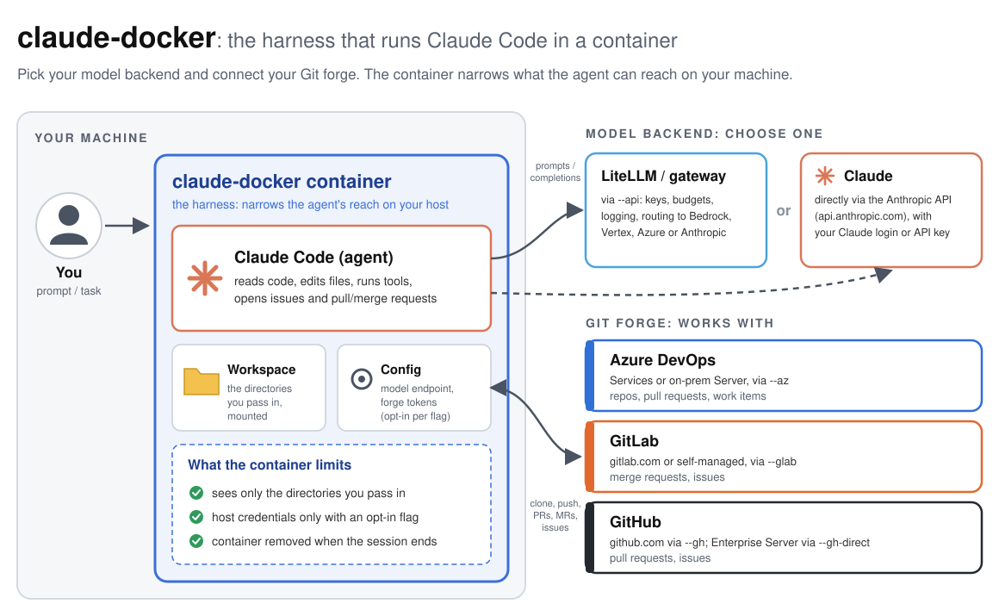

# claude-docker

[](https://github.com/schubergphilis/claude-docker/releases)
[](LICENSE)

</a>

**claude-docker runs [Claude Code](https://code.claude.com/docs) in a container on your machine.** Claude Code works on the repositories you pass in, with your model backend (the Anthropic API, or a gateway such as LiteLLM) and your Git forge. Your Claude Code setup (statusline, skills, agents, slash commands) comes along read-only, and the image ships `gh`, `glab`, `aws`, `az` with the `azure-devops` extension, `openspec`, `uv`, `pnpm`, `tfenv`, `git-lfs`, `task` and a version-pinned `go`; `tfenv` and `uv` fetch your project's Terraform and Python on demand. The container narrows what the agent can reach: it sees only the directories you pass in, gets host credentials (`gh`, `glab`, `aws`, `tfe`, `az`) only with a [flag](docs/auth.md#credential-opt-in), and is removed when the session ends. That makes it a safer place to let the agent work unattended than `claude --yolo` on your host, though not a full sandbox: see the [threat model](docs/security.md#threat-model) and [Vision and scope](docs/vision-and-scope.md).



## Quickstart

```bash
# Build the image from your checkout (one-time; rerun after Dockerfile or tool pins change)
docker build -t claude-code:local .

# Put on your PATH (create ~/bin if it doesn't exist)
mkdir -p ~/bin
ln -s "$(pwd)/run.sh" ~/bin/claude-docker
```

Then run it against a workspace:

```bash
claude-docker ~/repo
```

The build needs BuildKit — on a Homebrew `docker` CLI with Colima, see [BuildKit on Colima](docs/installation.md#buildkit-on-colima) first. On podman, see [Container runtime](docs/usage.md#container-runtime).

### Prebuilt image

Building from your checkout stays fully supported, and `run.sh` still defaults to `claude-code:local`. Released versions are also published to `ghcr.io/schubergphilis/claude-docker` for `linux/amd64` and `linux/arm64`; point the wrapper at one with the `CLAUDE_DOCKER_IMAGE` override:

```bash
docker pull ghcr.io/schubergphilis/claude-docker:v0.1.0
export CLAUDE_DOCKER_IMAGE=ghcr.io/schubergphilis/claude-docker:v0.1.0
```

Pin the full `v`-prefixed tag — there is no `latest` and no `:0.1`. Only `linux/amd64` passes the publish pipeline's dockle, dive and grype scans; `linux/arm64` is published without them. See [Prebuilt image from GHCR](docs/installation.md#prebuilt-image-from-ghcr) for release candidates and the scan-coverage detail.

## Documentation

- [Vision and scope](docs/vision-and-scope.md) — what claude-docker is for, its principles, defaults and options
- [Installation](docs/installation.md) — BuildKit on Colima, prebuilt image from GHCR
- [Usage](docs/usage.md) — container runtime, session flags, resuming sessions, host config parity, worktrees, split panes, extending the image
- [Auth model](docs/auth.md) — credential opt-in flags, AWS SSO, GitHub auth proxy, Terraform Cloud, private registries, custom model endpoint, API egress lock, egress allowlist, Azure DevOps Server CA
- [Security](docs/security.md) — threat model, image vulnerability scanning
- [Maintenance](docs/maintenance.md) — updating pinned tool versions, CI smoke tests
- [Windows](docs/windows.md) — PowerShell, WSL2 and Git Bash hosts
- [Scope](docs/scope.md) — what claude-docker deliberately does not do
- [License](docs/license.md) — Apache 2.0 terms and warranty disclaimer

Behavioural requirements live in [`openspec/specs/`](openspec/specs/); change history in [`openspec/changes/archive/`](openspec/changes/archive/).
